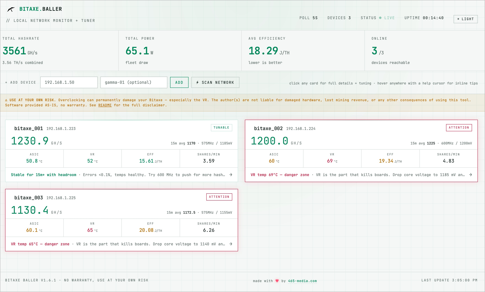
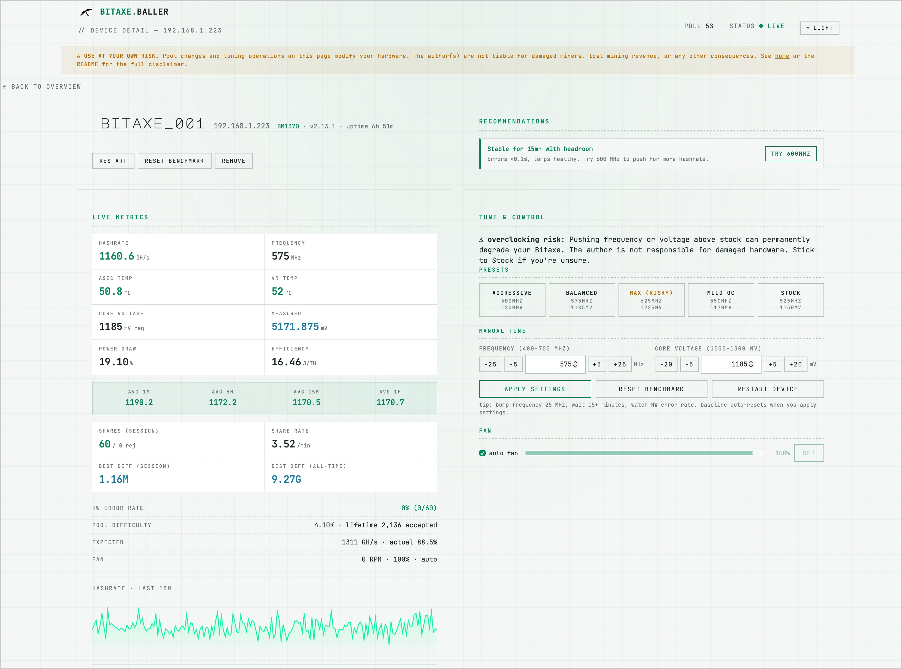
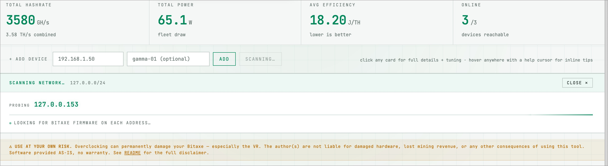

# Bitaxe Baller

**v1.8.2** — Live dashboard + tuner for Bitaxe miners on your local network. Native desktop app for Mac and Windows. Click the icon, a window opens with every Bitaxe on your network — temps, hashrate, tuning recommendations, pool config. Other devices on your LAN reach the same dashboard at `http://bitaxe-baller.local`. Free, MIT-licensed, no telemetry.

<p align="center">
  
</p>

[**↓ Download for Mac**](https://bitaxeballer.com/download/mac) · [**↓ Download for Windows**](https://bitaxeballer.com/download/windows) · [bitaxeballer.com](https://bitaxeballer.com) · [Roadmap](https://bitaxeballer.com/roadmap.html) · [Changelog](https://bitaxeballer.com/changelog.html) · [Support / FAQ](https://bitaxeballer.com/support.html)

> ## ⚠️ Disclaimer — read this before clicking anything
>
> **Overclocking can permanently damage your Bitaxe.** Pushing frequency or voltage past stock raises temperatures, accelerates silicon degradation, and in extreme cases can let the magic smoke out — especially on the VR (voltage regulator), which is what kills boards. The presets and bounds in this tool are chosen to be conservative, but **conservative is not the same as safe.**
>
> By using Bitaxe Baller you agree that:
>
> - You're tuning **your own hardware at your own risk**.
> - The author(s) and contributors are **not liable** for any damage to your miner, lost mining revenue, electricity costs, fire, water damage, voided warranties, or other consequences arising from use of this tool.
> - The "safety bounds" baked into the app (frequency 400–700 MHz, core voltage 1000–1300 mV) are **upper guardrails, not recommendations** — sustained operation at the high end of those ranges WILL shorten chip life.
> - Software is provided **AS-IS, without warranty of any kind**. See [LICENSE](./LICENSE).
>
> If you don't accept this, don't click "apply." Stick to stock and you'll be fine.

## Two ways to run it

**Option A — the standalone desktop app** (most users):
- **Mac**: download the signed + Apple-notarized `.dmg` from [bitaxeballer.com/download/mac](https://bitaxeballer.com/download/mac), drag to Applications, launch from Spotlight.
- **Windows**: download the Inno Setup installer from [bitaxeballer.com/download/windows](https://bitaxeballer.com/download/windows), run it (per-user, no admin), launch from Start Menu. The installer is Authenticode-signed via Azure Trusted Signing (Verified publisher: Nathan Baldwin). New installs may still see a brief SmartScreen download prompt for the first few weeks while Microsoft's reputation system catches up; clicking *More info* → *Run anyway* proceeds, no further warnings during install.

Either way: click the icon, a window opens with the dashboard. No terminal, no Python, no config files.

**Option B — from source** (developers, Linux, anyone who prefers Python):

```bash
git clone https://github.com/465media/bitaxe-baller.git
cd bitaxe-baller
python3 -m venv venv && source venv/bin/activate
pip install -r requirements.txt
python app.py
```

Then open `http://localhost:5050` (or `http://bitaxe-baller.local:5050` from any device on your LAN). With `sudo $(which python) app.py` you bind port 80 and drop the `:5050` suffix.

## Screenshots

<p align="center">
  
  <br><em>Home — one card per device, scales from 3 miners to 30. Health borders flag attention.</em>
</p>

<p align="center">
  
  <br><em>Detail — full metrics, hashrate + temps charts, tuning, fan, pool config, recommendations, event log.</em>
</p>

<p align="center">
  
  <br><em>Network scanner — probes the host's /24 in parallel, finds Bitaxes in under 6 seconds.</em>
</p>

## Two views: scannable home, deep detail

**Home (`/`)** — one compact card per device, designed to scale from 3 miners to 30. Each card shows:
- Device name + IP + online dot
- Current hashrate (large, the headline) and 15-minute average
- ASIC temp · VR temp · J/TH · share rate per minute
- Top recommendation summary (or "All stable · no action needed")
- A **health border** colored by the highest-severity recommendation: red for crit, yellow for warn, accent-green for tunable opportunities, neutral for stable. Devices that need attention literally outline themselves.

Click any card → full detail page.

**Detail (`/device/<ip>`)** — everything you'd want to know about one miner:
- Live metrics grid (frequency, voltage, temps, power, efficiency) and four rolling averages
- Hashrate + temps charts
- Shares & difficulty (session + lifetime, best diff formatted as 9.27G etc, pool difficulty)
- **Recommendations panel** with one-click apply
- **Tune & control**: Stock / Mild / Balanced / Aggressive / Max presets · manual frequency + voltage with ±5 / ±25 buttons · benchmark reset · restart
- **Fan controls**: auto-fan toggle and manual percentage slider
- **Pool / stratum config**: primary + fallback URL, port, worker, password, TLS, suggested difficulty. Worker passwords are write-only — leave the field blank to keep what's already on the device.
- Event log per device (last 50 entries)

**Across both pages**: light/dark theme, inline tooltips on every metric, full keyboard navigation.

## Network scanner

Click **⚡ scan network** on the home toolbar to auto-discover Bitaxes on your LAN. The scanner probes every IP in the host's `/24` in parallel, hits each one's `/api/system/info` with a 1.5 s timeout, and returns the ones that respond like Bitaxes (`hashRate` + `ASICModel`). Already-added devices and the host itself are skipped. A full /24 typically completes in 3–6 seconds. Only RFC1918 private ranges are scanned.

## LAN access — three ways to reach the dashboard

The app binds to `0.0.0.0` by default, so any device on your network can use the dashboard. Pick whichever URL is easiest:

1. **Native window on the host** — the desktop app opens its own window; nothing to type.
2. **`http://bitaxe-baller.local`** — published via mDNS (Bonjour on macOS/iOS, Avahi on Linux, native on Windows 10+). Same URL works from your phone, tablet, or laptop.
3. **`http://<host-ip>`** — fallback if a device on the LAN doesn't resolve `.local` (some Android builds, some routers).

The startup output prints all reachable URLs.

## Recommendation engine

Up to three suggestions per device, ranked by severity (`crit` > `warn` > `good` > `info`). Rules are transparent and conservative, not an autotuner — each suggestion has an optional one-click apply.

| Trigger | Severity | Suggested action |
|---|---|---|
| VR temp ≥ 65°C | crit | Drop core voltage 15 mV |
| HW error rate ≥ 1% (after 20+ session shares) | crit | Drop core voltage 10 mV |
| HW error rate 0.5–1% | warn | Add 10 mV (more stability) or back off frequency |
| ASIC ≥ 65°C, VR < 65°C | warn | Enable auto-fan / improve airflow |
| 5m hash < 92% of 15m hash | warn | Reset benchmark and re-baseline |
| Stable 15+ min, errors < 0.1%, temps healthy | good | Try +25 MHz |
| Hashrate < 85% of expected (after 5 min) | info | Could be silicon lottery — check HW errors |
| J/TH ≤ 16 with 0% errors and cool temps | good | Hold this point — excellent efficiency |

The engine waits ~3 minutes after a device is added or its benchmark is reset before producing real tuning suggestions (so it doesn't fire on noisy startup data).

## Color thresholds (Gamma-tuned)

| Metric | Good (green) | Warn (yellow) | Crit (red) |
|--------|-------------|---------------|-----------|
| ASIC temp | <60°C | 60–65°C | >65°C |
| VR temp | <55°C | 55–65°C | >65°C |
| HW error rate | <0.1% | 0.1–0.5% | >0.5% |
| Efficiency | <16 J/TH | 19–22 J/TH | >22 J/TH |

VR temp matters more than ASIC temp for board longevity. Watch it.

## Suggested tuning workflow

1. Apply the **Stock** preset, let it run 15+ minutes. Note the 15m average hashrate, J/TH, and HW error rate.
2. Click **Mild OC** preset. The benchmark resets automatically. Wait 15 minutes again.
3. If HW error rate stays under 0.5% and temps are healthy, try **Balanced**. Repeat.
4. When errors start climbing or efficiency stops improving, you've found your sweet spot. Back off one notch.

For fine tuning, use the manual ± buttons: frequency in 25 MHz jumps, then trim with 5 MHz; voltage in 5–10 mV bumps. The recommendation engine surfaces concrete next steps as the data comes in.

## Safety bounds (server-enforced)

The app refuses settings outside these ranges regardless of what you enter:

- Frequency: 400–700 MHz
- Core voltage: 1000–1300 mV
- Fan speed: 0–100%

The BM1370 is rated up to ~1300 mV but that's where chip degradation becomes a real concern. Stay under 1225 mV unless you really know what you're doing.

## Logs

Every poll (every 5s) is appended to `logs/<label>_<date>.csv` per device.

- **Standalone app**: `~/Library/Application Support/Bitaxe Baller/logs/`
- **From source**: `logs/` next to `app.py`

Columns: timestamp, ISO time, hashrate, ASIC temp, VR temp, power, voltage (measured), core voltage (requested), frequency, shares accepted, shares rejected, uptime. Open in Excel or pandas to compare settings over time.

## Roadmap

### Shipped in v1.8 (Pro tier)

- ~~Bulk-apply mode: select multiple devices and push the same tuning in one shot~~ ✅
- ~~Auto-tune sweep mode (frequency steps with HW-error guardrails)~~ ✅
- ~~Long-term history (persistent SQLite, weeks/months of metrics)~~ ✅
- ~~Discord alerts on offline or temperature thresholds~~ ✅

### Still to ship

- ~~True in-place auto-updates (Sparkle/WinSparkle) — Pro, paired with a Windows code-signing cert~~ ✅ v1.8.2 (Mac Pro auto-update + Windows Authenticode signing)
- Email + Telegram alert channels — Pro, v1.8.x
- `start.sh` one-liner that creates the venv, installs deps, runs the app
- launchd plist template for run-on-boot on macOS
- A/B comparison mode: pin two settings snapshots side-by-side
- WebSocket push instead of 5s polling (matters at >10 devices)
- Multi-model presets for Supra (BM1368) and Ultra (BM1366) — **free**, never paywalled

**Bitaxe Baller Pro** launched in v1.8 — bulk tuning, auto-tune sweeps, 90 days of history, Discord alerts. $29/year, 5 machines per license. Free tier stays fully featured forever. [Full breakdown at bitaxeballer.com/pro](https://bitaxeballer.com/pro.html).

## License

MIT — see [LICENSE](./LICENSE). TL;DR: do whatever you want with it, just don't sue if your Bitaxe melts.

Marketing site copy, brand assets, and the bitaxeballer.com infrastructure are © 2026 Nathan Baldwin / 465 Media (separate private repo, not licensed under MIT).

## Built by

[465-media.com](https://465-media.com) · made with ♥ in NH
